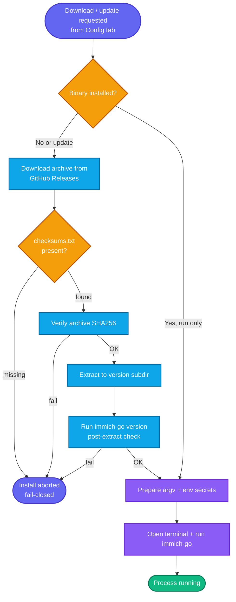

# Configuration

The **Config** tab holds global settings shared across workflow tabs: Immich server credentials, theme, terminal preference, and immich-go binary management.

## Immich Server

| Field | Description |
|-------|-------------|
| **Server URL** | Base URL of your Immich instance (e.g. `https://immich.local`). Used by upload tabs, Stack, and Archive from Immich. |
| **Skip SSL verification** | Bypass TLS certificate validation. Shows an inline warning when enabled. Use only for local/self-signed setups. |
| **API Key** | Your Immich user API key. Stored in the OS keychain by default — never written to plain TOML. |
| **Admin API Key** | Optional elevated key. Required only if you want Immich background jobs paused during upload/stack. Also stored in the keyring. |

### Connection Testing

Use **Test Connection** on the Config tab to call `{server}/api/server/about` with your API key. The same endpoint is used as a **pre-flight check** before server-required runs; a failure blocks launch and shows an error.

Server-required tabs: all Upload tabs, Archive from Immich, and Stack. See [CLI Command Mapping](../reference/cli-command-mapping.md).

### Admin API Key and Job Pausing

Immich can pause background jobs while immich-go runs (`pause-immich-jobs`, enabled by default upstream for upload/stack). That API call needs an **admin** key.

**Where to control pausing:** `pause-immich-jobs` is a **per-tab Advanced Flags row** on upload and Stack tabs — not a Config-tab toggle. In simple mode, the flag is not emitted unless you enable it on the tab's Advanced card.

| Admin key set? | Advanced row enabled? | What the GUI does |
|----------------|----------------------|-------------------|
| Yes | Yes (user checked) | Emits `--pause-immich-jobs` (or the value you set) |
| No | Yes | **Auto-disables** pausing via safety pass: emits `--pause-immich-jobs=false` and adds a warning — avoids a hard `403 Forbidden` abort |
| Any | No (default) | Flag not emitted; immich-go applies its own default |

**Recommendation:** create an admin API key in Immich if you upload large libraries and want Immich to stop thumbnail/metadata jobs from competing for I/O. Otherwise leave the admin field empty; the safety pass prevents 403 errors when pausing would otherwise be requested.

## Configuration Lifecycle

```mermaid
stateDiagram-v2

    [*] --> Default

    Default --> Modified

    Modified --> Saved

    Saved --> Loaded

    Loaded --> Modified

    Saved --> Deleted

    Deleted --> Default
```

## Secret Storage

API keys are handled securely:

1. **OS Keychain (default)** — macOS Keychain, Windows Credential Manager, or Linux Secret Service via the `keyring` library.
2. **Plaintext fallback** — If keyring is unavailable, secrets may be stored in `secrets.toml` inside the profile directory (see [Config Schema](../reference/config-schema.md)).

Secrets are passed to immich-go through **environment variables**, not command-line arguments. The command preview masks all secret values.

## immich-go Binary Management



The GUI bundles no immich-go binary inside the app. Downloads are triggered from the **Config tab** (or when you confirm a download prompt before run) — not on every application launch.

| Location | Path |
|----------|------|
| Binary base directory | `~/.immich-go-gui/bin/` |
| Versioned binary | `~/.immich-go-gui/bin/{version}/immich-go` (or `immich-go.exe` on Windows) |
| Metadata file | `~/.immich-go-gui/bin/metadata.json` |

`metadata.json` records `selected_version`, per-version paths, and download metadata. Legacy installs may still have a flat `~/.immich-go-gui/bin/immich-go`; the resolver checks version subdirectories first.

The Config tab shows:

- Installed version and support status (tested, untested, unsupported)
- Option to download or update the binary
- Compatibility warnings for versions outside the tested range

See [immich-go Compatibility](../reference/immich-go-compatibility.md) for version details.

## Theme and Terminal

| Setting | Options | Description |
|---------|---------|-------------|
| Theme | System / Light / Dark | UI appearance |
| Preferred terminal | Auto or specific emulator | Which terminal opens when you click Run (platform-dependent) |

## Saving Configuration

Configuration is saved automatically when you change settings or switch tabs. Each profile has its own `config.toml`. Form field values for workflow tabs are stored in the `form_state` section of that file.

### Config File Locations

| Platform | Default directory |
|----------|-------------------|
| Linux | `~/.config/immich-go-gui/` |
| macOS | `~/Library/Application Support/immich-go-gui/` |
| Windows | `%APPDATA%\immich-go-gui\` |

Override the config file path with the `IMMICH_GO_GUI_CONFIG` environment variable. See [Config Schema](../reference/config-schema.md).

## Simple vs Advanced Mode

Toggle **Advanced mode** in the Config tab to show additional flag rows on workflow tabs. Simple mode keeps the UI focused on high-frequency options; advanced mode exposes the full immich-go flag surface allowed for each tab. See [Advanced Flags](advanced-flags.md).

## Related

- [Security & Privacy](security-and-privacy.md) — Keyring, env delivery, SSL
- [Profiles](profiles.md) — Multi-server setups
- [Platform Notes](platform-notes.md) — Config paths per OS
- [Choose Your Workflow](choose-your-workflow.md)
